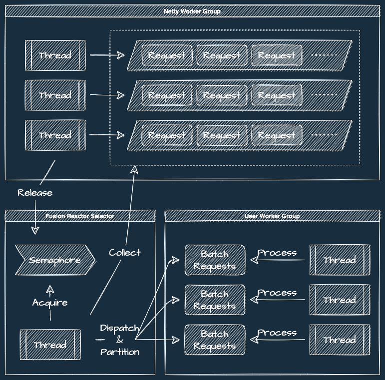
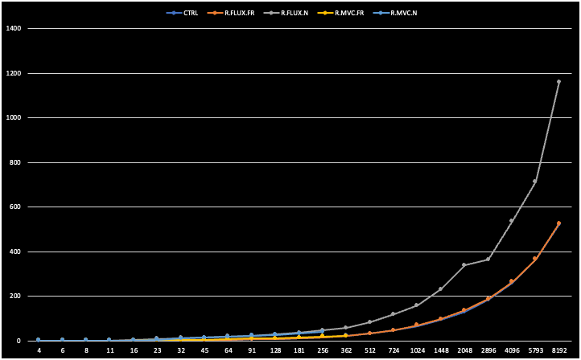
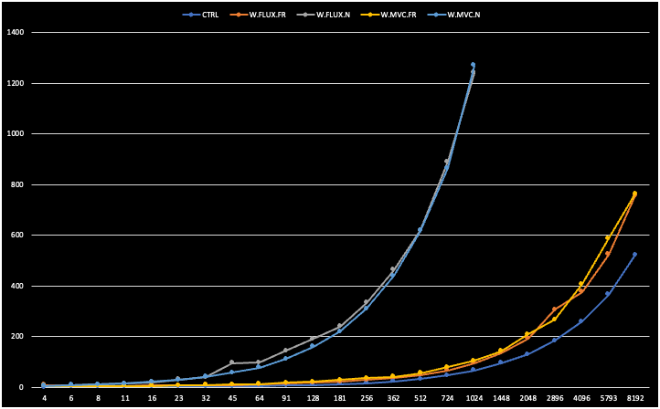

# Reactor Extension

Some useful utilities that help developers to build high-performance backend applications based on Project Reactor.

## Fusion Reactor

In common case, high-concurrency business scenario many related to hot data accessing:

- Video information fetching when popular series' update become available.
- Account balance modifying when big hit youtuber set up a livestream.
- Billing account modifying when user clicking advertisement on website.

Most of the tech teams may use these methods to solve these problems:

- Add cache system for high-concurrency reads.
- Add message queue for high-concurrency writes.

However, cache control and asynchronous processing may take extra cost:

- Operators have to maintain cache and message queue middleware.
- Developers have to write more codes to improve reliability of the system.
- Developers need to find out data fixup solutions when data become unexpectedly inconsistent.

So, is there a low-cost solution to improve high-concurrency performance? Fusion Reactor is the answer:

- Feature: Aggregate a batch of requests in to a collection.
- Feature: Distinguish duplicated requests and only process once.
- Feature: Separate requests into different partitions to reduce data races.

### Architecture



### Performance Benchmarking

Environment:

- Docker container with 4 core CPU and 8 GB memory
- MySQL 5.7 runs in separate machine
- Apachebench runs in Docker's host machine

Experimental groups:

| ID        | Business Scenario                                    | Architecture    | Fusion Reactor |
|-----------|------------------------------------------------------|-----------------|----------------|
| CTRL      | Reply 'Hello'                                        | WebFlux (Netty) | OFF            |
| R.MVC.N   | Read same row from DB                                | WebMVC (Tomcat) | OFF            |
| R.MVC.FR  | Read same row from DB                                | WebMVC (Tomcat  | ON             |
| R.FLUX.N  | Read same row from DB                                | WebFlux (Netty) | OFF            |
| R.FLUX.FR | Read same row from DB                                | WebFlux (Netty) | ON             |
| W.MVC.N   | Modify same row with lock and insert a new row to DB | WebMVC (Tomcat) | OFF            |
| W.MVC.FR  | Modify same row with lock and insert a new row to DB | WebMVC (Tomcat) | ON             |
| W.FLUX.N  | Modify same row with lock and insert a new row to DB | WebFlux (Netty) | OFF            |
| W.FLUX.FR | Modify same row with lock and insert a new row to DB | WebFlux (Netty) | ON             |

Hot data read QPS:


Hot data read P99:



Hot data modify QPS:


Hot data modify P99:



### Code example

Let's say we have a livestream system which allow user to make donation to youtuber:

- Page showing may produce high-qps reads on live room's meta information.
- Donations may produce high-qps data race on youtuber's balance account.

The persistence model might be declared as:

```sql
create table live_room
(
    id       bigint      not null primary key,
    owner_id bigint      not null comment 'uid of room owner',
    name     varchar(24) not null comment 'name of the room',
    -- other attributes...
    unique key unq_owner_id (owner_id)
);

create table live_account
(
    id       bigint         not null primary key,
    owner_id bigint         not null comment 'uid of room owner',
    balance  decimal(20, 2) not null comment 'balance of the account',
    -- other attributes...
    unique key unq_owner_id (owner_id)
);

create table live_donation
(
    id         bigint         not null primary key,
    batch_no   varchar(36)    not null comment 'unique identifier of the donation',
    account_id bigint         not null comment 'refer to live_account.id',
    amount     decimal(20, 2) not null comment 'balance of the account',
    -- other attributes...
    unique key unq_batch_no (batch_no)
);
```

The service's interface might be declared as:

```java
public interface LiveService {
    Map<Long, LiveRoom> batchFindLiveRooms(Set<Long> roomIds);

    Map<String, LiveDonation> batchDonate(List<LiveDonationOrder> orders);
}
```

To improve the performance, developer can wrap the above interface into reactive mode by using Fusion Reactor:

```java
public class ReactiveLiveService {
    private FusionReactor<Long, LiveRoom> findLiveRoomReactor;
    private FusionReactor<LiveDonationOrder, LiveDonation> donateReactor;

    public ReactiveLiveService(FusionFactory fusionFactory, LiveService liveService) {
        // create reactor instances by FusionFactory and customized functions
        findLiveRoomReactor = fusionFactory.getInstance(
                FusionReaction.simpleIdentified(
                        Function.identity(),
                        roomIds -> Mono.fromCallable(() -> liveService.batchFindLiveRooms(new HashSet<>(roomIds)))));
        donateReactor = fusionFactory.getInstance(
                FusionReaction.simplePartitioned(
                        LiveDonationOrder::getAccountId,
                        LiveDonationOrder::getBatchNo,
                        orders -> Mono.fromCallable(() -> liveService.batchDonate(new ArrayList<>(orders)))));
    }

    public Mono<LiveRoom> findLiveRoom(Long roomId) {
        return findLiveRoomReactor.react(roomId);
    }

    public Mono<Donation> donate(LiveDonationOrder order) {
        return donateReactor.react(order);
    }
}
```
